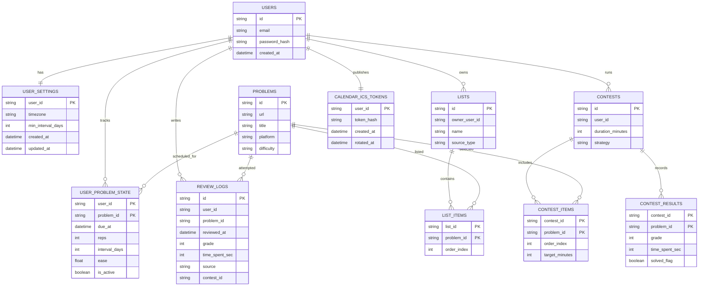

# PrepTracker

Interview prep tracker with spaced repetition scheduling (SM-2), review logging, and timed contest generation. PrepTracker is not a coding platform: it links out to LeetCode/NeetCode/etc and tracks your recall/revision cadence.

## Key Features (MVP)

- Problem library (URL + metadata)
- Daily due list (overdue, due today, due soon)
- Review logging with grade (0-4) and optional time spent
- SM-2 scheduler with per-user minimum interval policy (Policy A in `AGENTS.md`)
- Template list imports (Blind 75, NeetCode 150) as editable snapshots
- Timed contests generated from your existing problems
- Google Calendar integration (free): subscribe to a private ICS feed to see due reviews on Google Calendar
  - User controls the daily notification time via settings (event start time)

## Tech Stack (Planned)

- Backend: Go (REST) + PostgreSQL
- Frontend: Next.js (App Router) + Tailwind + shadcn/ui
- Migrations: golang-migrate (or atlas)
- Auth: backend-managed auth (JWT access token + DB-backed refresh token), based on patterns from `/mnt/VaultD/Projects/ApptRemind/services/auth-service`
- Calendar MVP: ICS feed subscription (no Google OAuth)

## Architecture (Modular Monolith)

Single backend service with clear internal module boundaries. The auth module can be extracted into a dedicated `auth-service` later.


## Data Flows

Review logging and rescheduling:


Google Calendar (free MVP via ICS subscription):


## Database Design (MVP)



## Docs

- Product requirements and domain rules: `AGENTS.md`
- Phased execution plan: `docs/plans/2026-02-08-preptracker-phased-plan.md`
- System design (more diagrams): `docs/system-design.md`

## Local Development (Backend)

```bash
make compose-up
make migrate-up
PORT=18080 make api
```

API docs:
- Swagger UI: `http://localhost:18080/docs`
- OpenAPI spec: `http://localhost:18080/openapi.yaml`

## Local Development (Frontend)

Run the API (above), then:

```bash
cd apps/web
cp .env.example .env.local
npm install
npm run dev
```

Web app: `http://localhost:3000`

## Local Development (Docker, Full Stack)

Starts Postgres + migrations + API + Web:

```bash
PREPTRACKER_API_PORT=18080 PREPTRACKER_WEB_PORT=13000 make compose-up-all
```

Web app: `http://localhost:13000`
API docs: `http://localhost:18080/docs`

## E2E Tests (Playwright)

Bring the stack up, then run:

```bash
PLAYWRIGHT_BASE_URL=http://localhost:13000 npm -C apps/web run test:e2e
```

Run tests:

```bash
make test
make test-db
```

## Docker

```bash
PREPTRACKER_API_PORT=18080 make compose-up-all
```

Then open `http://localhost:18080/docs`.

## User Settings

- `timezone`: used to compute due dates and render calendar events.
- `min_interval_days`: SM-2 Policy A minimum spacing.
- `due_hour_local` and `due_minute_local`: the local time for daily calendar events and due date anchoring.
  - Update via `PATCH /api/v1/users/me/settings`

## Notes

- Google Calendar sync MVP intentionally avoids OAuth and uses an ICS subscription URL so it stays free and simple.
