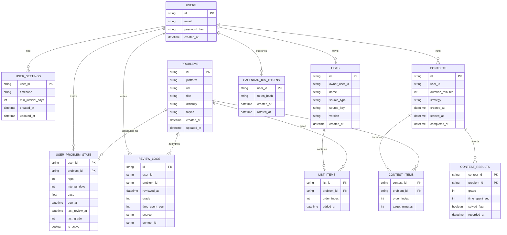

# PrepTracker System Design

This document describes the modular monolith backend architecture, boundaries, and key data flows.

## Goals (MVP)

- Ship the daily review loop quickly with strong correctness guarantees.
- Keep append-only review history so algorithm upgrades (FSRS) are possible later.
- Keep auth as a clean boundary so it can be extracted to a dedicated service if needed.
- Google Calendar integration stays free and low-friction (ICS subscription).

## High-Level Components

## Module Boundaries (Conventions)

- `Auth`: owns credentials and session lifecycle. Exposes user identity via JWT claims.
- `Domain`: all business logic uses `user_id` from JWT claims; never trusts client-sent `user_id`.
- `Scheduler`: pure function(s) for SM-2 + Policy A; called only from review/contest write paths.
- `Calendar`: read-only view over due items that emits `text/calendar` (ICS). No Google OAuth in MVP.

Extraction-friendly conventions:
- No other module reads auth tables directly (only via a small internal auth interface).
- Domain tables key everything by `user_id` and never join on auth implementation details.
- Avoid implicit coupling through shared DB schemas; if convenient, place auth tables in a dedicated schema.

## Primary Data Model (MVP)

## Data Flow: Scheduler Update (Transactional)

## Data Flow: Google Calendar (ICS)

In MVP, the API emits the ICS dynamically. No background sync is required.

## Security Notes (MVP)

- ICS URL is private. Treat it as a password:
  - generate a long random token
  - store only a hash server-side
  - allow rotation (invalidates old URL)
- All domain endpoints require JWT auth; never accept `user_id` from clients.
